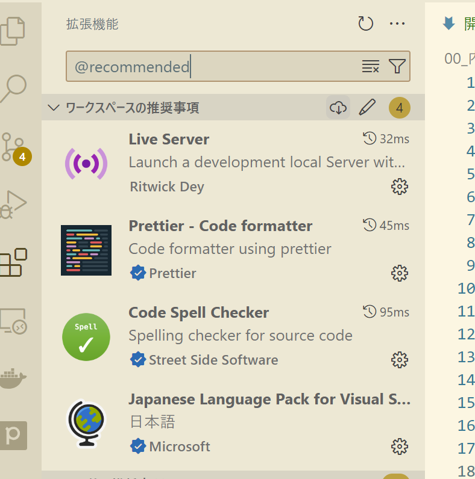
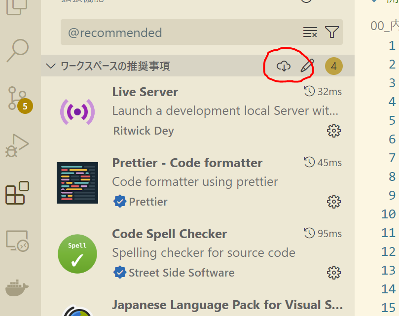
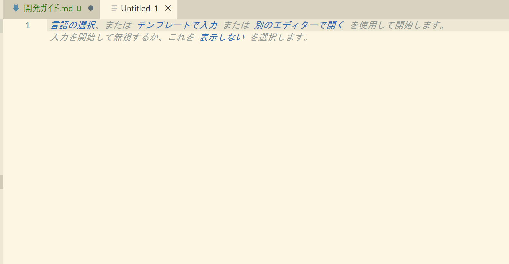
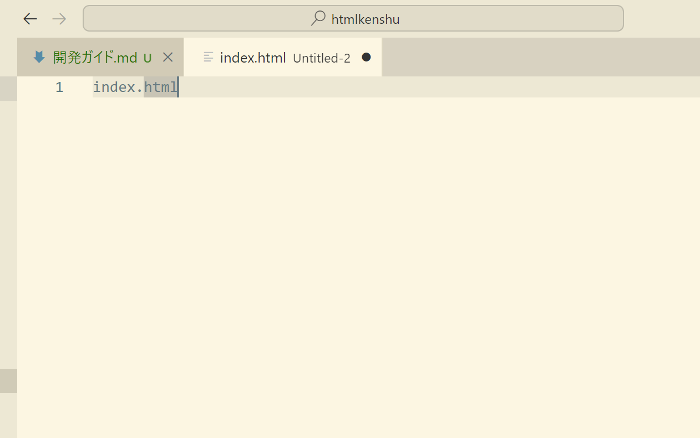
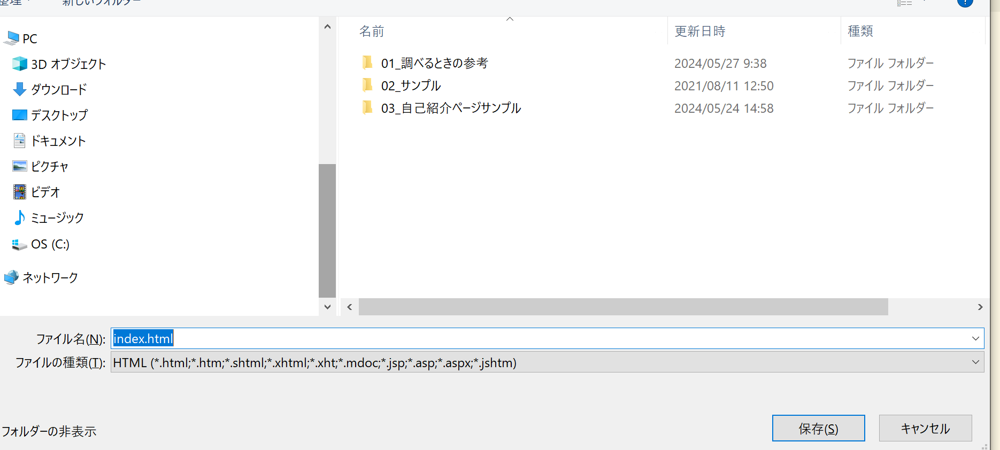
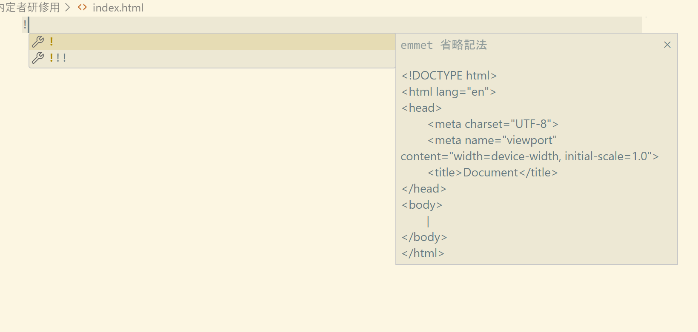
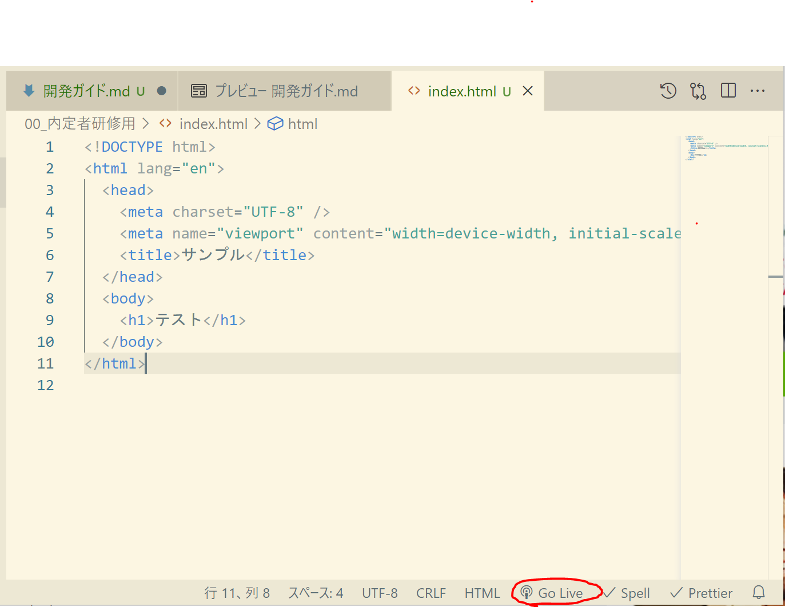
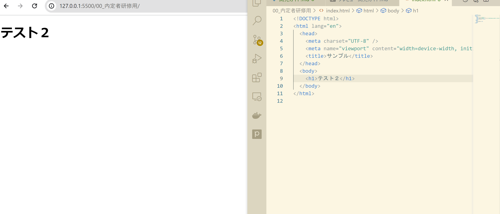
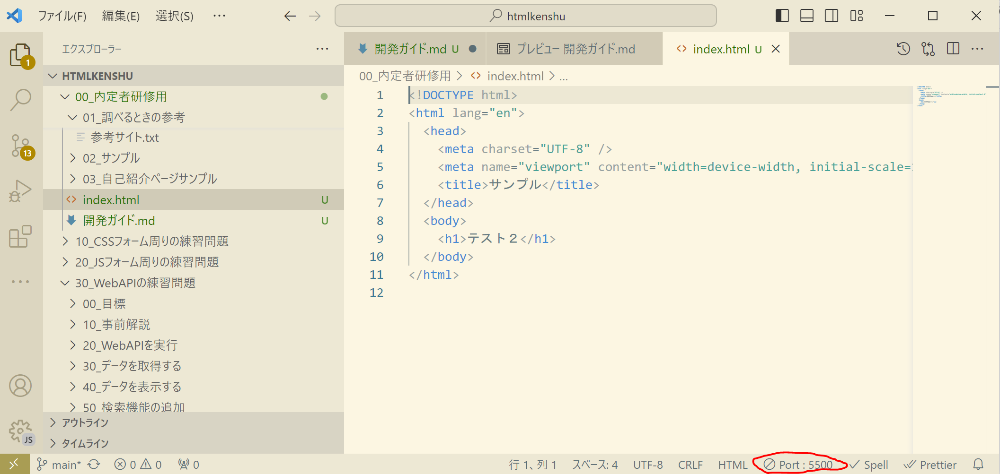

# HTML 研修

## 概要

このプロジェクトは、HTML の初学者が HTML を学習するためのプロジェクトです。

## インストール

### 前提条件

- VSCode をインストールしていること
- 既に資材をローカルにダウンロードしていること

### 手順

1. 推奨拡張機能のインストール

   1. `ctrl + shift + X`で拡張機能を開き`@recommended`を入力する
      
   1. おすすめの拡張機能のインストールをする
      
   1. 再起動する

## HTML の作成方法

1. `ctrl + n`で新規ファイルを作成する。
   
1. `index.html`などのファイル名を入力する。
   
1. `ctrl + s`で任意の場所へ保存する。
   
1. ファイル名をつけた際の入力を削除し、`!`、`tab`でテンプレートを自動補完できる
   
   　 [Emmet(自動補完機能)](https://qiita.com/mikd/items/183023f99db8954a0443)

## HTML の表示方法（Live Server）

1.  **表示したい HTML を選択した状態**で、VSCode 右下の`Go Live`を押下する
    

1.  修正内容を保存`ctrl + s`すると自動で反映される
    

1.  間違ってブラウザを閉じた場合などは、一度停止し、もう一度`Go Live`を押下すると再度開かれる。
    
