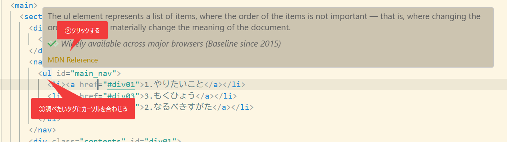

# 調べ方とAIプロンプト

「やりたいこと別サンプル」で見つからないときは、自分で調べます。**調べる力**は、これから先いちばん長く役立つスキルです。

困ったら、次の順番で調べてみましょう。

1. **① VS Code で調べる（MDN）** … タグやプロパティの「意味」を知りたいとき
2. **② AI に聞く** … 「やり方」や「なぜ動かないか」を知りたいとき

まず ① で公式の説明を見て、それでも分からなければ ② で聞く、が基本の流れです。

---

## ① VS Code でタグの意味をすぐ調べる（MDN）

実は、調べるのにわざわざブラウザを開かなくても大丈夫。**VS Code でタグやプロパティにマウスカーソルを合わせる**だけで、その意味の説明と「**MDN Reference**」というリンクが出てきます。

> **MDN とは？** … HTML / CSS / JavaScript の**公式リファレンス**（説明書）です。世界中の開発者が使う、いちばん信頼できる情報源。日本語版もあります → [MDN Web Docs（日本語）](https://developer.mozilla.org/ja/)

### やり方は2ステップ

1. 調べたいタグ（例 `<ul>`）に**マウスカーソルを合わせる**
2. 出てきた説明の下の「**MDN Reference**」を**クリック**する

すると、ブラウザで MDN の公式ページが開きます。



### ここがポイント

- **CSS のプロパティ**（`color`、`display` など）でも、同じようにカーソルを合わせれば調べられます。
- 説明や MDN のページは**英語**のことが多いですが、ブラウザの翻訳機能や、② の AI に「日本語で説明して」と頼めば大丈夫。
- MDN は**公式**なので、ネットの記事よりも**正確で安心**。「この書き方で合ってる？」の最後の確認にも使えます。

> もちろん、ふつうにネットで検索してもOK。そのときは検索語に **`MDN`** を足す（例「flex 横並び MDN」）と、公式ページが見つかりやすくなります。

---

## ② AI に聞く（ChatGPT / Claude など）

「やり方が分からない」「書いたのに動かない」ときは、AI に聞くのが近道です。
ただし、**聞き方**しだいで答えの質は大きく変わります。

### ❌ うまくいかない聞き方

- 「動きません。直して」… 何が・どう動かないのかが伝わらない
- 「いい感じにして」… ゴール（どうなってほしいか）が伝わらない
- コードもエラーも貼らない … AI は推測で答えるしかなく、はずれやすい

### ⭕ うまくいく聞き方

次の5点をそろえると、ぐっと当たりやすくなります。

> **前提**（初心者・HTML/CSS）　＋　**やりたいこと**　＋　**今のコード**　＋　**期待する結果**　＋　**エラー文（あれば）**

### コピペで使えるプロンプト例

`〇〇` を自分の言葉に書き換えて使ってください。

**やり方を聞く**

```
HTML と CSS の初心者です。〇〇したいです。
コード例と、その説明を初心者向けに教えてください。
```

**うまく動かないとき**

```
HTML / CSS の初心者です。次のコードが思ったとおりに動きません。
- やりたいこと：〇〇
- 期待する結果：〇〇
- 今のコード：
（ここにコードを貼る）
原因と、直したコード、その理由を初心者向けに教えてください。
```

**エラーの意味を聞く**

```
HTML / CSS の初心者です。次のエラーの意味と直し方を、やさしく教えてください。
（ここにエラーメッセージを貼る）
```

### もっとうまく聞くコツ

- 1回で完璧を狙わない。「**もっとやさしく**」「**別のやり方は？**」と続けて聞けます。
- もらったコードは、**一行ずつ意味を聞きながら**読むと力がつきます。

---

## こんなときどうする？（あるある早見表）

初心者が「あるある」でつまずくところと、その調べ方です。

| こんなとき                                   | どうする                                                                        |
| -------------------------------------------- | ------------------------------------------------------------------------------- |
| このタグ／プロパティ、何の意味？何ができる？ | **① VS Code** でカーソルを合わせて MDN を見る                                   |
| 書いた・変えたのに画面が変わらない           | まず**保存**（`Ctrl + S`）。直らなければ **F12** でエラーを見て **② AI** に聞く |
| 中央寄せ・横並びができない                   | **① MDN** で `text-align` / `flex` を確認、または **② AI** にコードを貼って聞く |
| 画像が表示されない                           | 画像の **置き場所（パス）** が合っているか確認 → **② AI** にエラーと一緒に聞く  |
| 赤い字・エラーが出た                         | エラー文を**そのままコピペ**して **② AI** に聞く                                |
| そもそも何をどう調べればいい？               | やりたいことを**日本語の単語**で（例「文字 中央 CSS」）。まずは **① MDN**       |

> **F12**（開発者ツール）は、ブラウザでエラーや原因を確認できる画面です。「Console（コンソール）」に赤い字でヒントが出ます。

---

## 注意（とても大事）

- **AI の答えはまちがうこともある**。必ず**自分で動かして確認**し、できれば ① の MDN で裏を取りましょう。
- **コピペだけ**だと身につきません。コードの意味を一行ずつ理解しながら使いましょう（模写演習の注意と同じ）。
